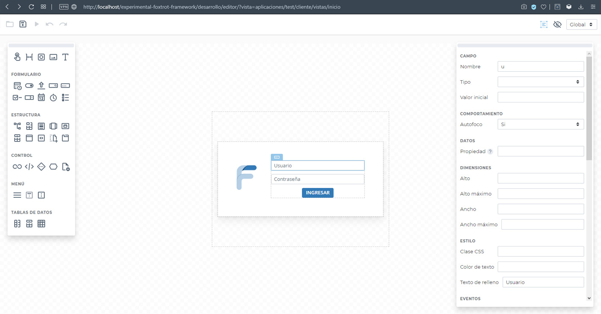

Trabajo en curso y experimentos para el desarrollo de Foxtrot 7. 

**Nota: No todo lo que se establece en la documentación funciona actualmente. ¡Pero estamos camino a la primer versión (*MVP*)!**

### Qué es Foxtrot Framework

Foxtrot es un framework de desarrollo rápido de aplicaciones web y móviles, con un **editor visual** de vistas, que integra cliente (*frontend*) en JavaScript y servidor (*backend*) _headless_ en PHP.

**[Accedé al Wiki para leer más sobre el proyecto, sus objetivos y su documentación](../../wiki/Inicio)**

**[Guía de inicio rápido](documentacion/primeros-pasos.md)**

**[Mirá el video de demostración de una aplicación Cordova](https://youtu.be/hNM4unnxXJg)**

**[Mirá el video de demostración de los asistentes](https://youtu.be/BuxehZ6bPkY)**

**[Mirá el video de demostración general](https://youtu.be/J7Ru9Mfumr8)**

**[Accedé a la aplicación de ejemplo](https://demo.f7.foxtrot.net.ar)**

Usuario: admin  
Contraseña: test

*Nota: La aplicación de ejemplo publicada es de código cerrado y solo se incluye en este repositorio una pequeña parte suficiente para demostrar la funcionalidad de Foxtrot y servir de guía para comenzar tu desarrollo.*

### Estado

 Editor de vistas completamente funcional.

 Integración *vista - controlador JS - controlador PHP* completa.

 Acceso a datos y ORM, completos.

 Ciclo de ejecución de la aplicación y la vista, completos.

 Integración de múltiples vistas en una sola página.

 Compilación para producción, funcionando (las aplicaciones ya se pueden ejecutar e implementar).

 Compilación para embeber en Cordova, funcionando (las aplicaciones ya se pueden compilar con Cordova y ejecutar en dispositivos).

#### Pendientes

Ver [Pendientes](documentacion/pendientes.md).

#### Aplicación de ejemplo

Se incluye una aplicación de ejemplo demostrando las funciones principales del framework.

[Más información](desarrollo/aplicaciones/ejemplo/README.md).

### Estructura del proyecto

`/fuente/` Código fuente del framework.

`/desarrollo/` Framework compilado + Código fuente de las aplicaciones.

`/produccion/` Framework y aplicaciones compilados.

`/embeber/` Framework y una aplicación específica compilados para embeber en Cordova o el cliente de escritorio.

`/scripts/` Scripts de compilación y asistentes.

### Qué estamos desarrollando

### Editor

Editor de vistas *WYSIWYG* *Drag&drop*. Almacena la vista lista para mostrar en HTML/CSS, pero sin perder la relación entre elementos del DOM y los objetos del framework.

El editor también permite configurar visualmente estructuras de control (bucles, condicionales, etc.), variables (acceso a datos) e integraciones con los controladores JS y PHP de la vista.

En el futuro, no solo será un editor, sino que se desarrollará un gestor interactivo de vistas, controladores, configuración, modelo de datos y demás recursos. Contará, además, con asistentes para creación de vistas y controladaores (por ejemplo, un ABMC en base al modelo de datos.)

[Más información sobre el editor](documentacion/editor.md).

[Listado de componentes](documentacion/componentes.md).

[Estructura y guía de desarrollo de componentes](documentacion/componentes-estructura.md).

### Estructura de las aplicaciones

El framework es multi-aplicación, simplificando el desarrollo y mantenimiento de múltiples proyectos en un servidor, tanto en desarrollo como en producción (una única instalación puede servir múltiples aplicaciones).

[Más información sobre las aplicaciones y su estructura](documentacion/estructura.md).

### API

El framework está dividido en cliente y servidor, pero desacoplados: Ambos pueden residir en la misma ubicación (el cliente se descarga desde el mismo servidor web) o separados (por ejemplo, cliente local en una aplicación móvil o de escritorio).

El lado del servidor está compuesto por controladores de servidor y el modelo de datos (incluye ORM propio).

El lado del cliente está compuesto por controladores de cliente y vistas. Cada vista está compuesta por componentes, los cuales guardan relación con los elementos del DOM y permiten la manipulación de la vista mediante sus métodos y propiedades. Existen componentes que representan estructuras de control (condicionales, bucles, inclusión de una vista dentro de otra, etc.) automatizando la presentación de información y la navegación. Incluye un gestor del DOM propio (reemplaza a jQuery).

**Comunicación cliente<->servidor transparente**

El framework permite una comunicación transparente entre controladores del lado del cliente y controladores del lado del servidor. El desarrollador puede invocar un método desde uno hacia el otro como si se tratara de una misma plataforma.

**Automatización**

(Idea/TODO) Posibilidad de construir controladores vinculados al origen de datos automáticamente mediante programación visual o un lenguaje imperativo simple, incluyendo validaciones y llamados a funciones PHP/JS para procesos específicos más complejos.

**Compilación**

Las aplicaciones se compilan con Closure y comprimen, para garantizar carga y ejecución rápidos, tanto en web como en dispositivos. Es compatible con Cordova y un cliente Windows que se encuentra en desarrollo.

**ORM**

Un ORM propio liviano y fácil de utilizar reduce al mínimo, o elimina en muchos casos, el uso de código SQL, aumentando así la seguridad y mejorando el diseño de los objetos de la aplicación. Se define íntegramente mediante objetos, contribuyendo con el control de errores y el autocompletado al escribir código. El ORM permite crear y mantener actualizada la estructura de la base de datos a partir del código PHP del modelo de datos. Además, como todo en Foxtrot, sus métodos están en español.

[Documentación del ORM](documentacion/api/orm.md).

**Intérprete lógico-matemático (JS)**

Desarrollamos un intérprete para permitir la inserción de variables, llamados a funciones y expresiones simples en cualquier texto, donde las expresiones se encierran entre `{` y `}`. La finalidad del mismo es simplificar el enlace de la interfaz con el código fuente y los datos.

El intérprete deberá portarse a PHP si se ofrece la posibilidad de pre-procesar algunos componentes del lado del servidor.

[Más información sobre el API](documentacion/api.md).

[Documentación](documentacion/api/indice.md).

### Colaboraciones

Toda colaboración es bienvenida. Podés ponerte en contacto con nosotros en contacto@foxtrot.ar para conversar y aclarar todas las dudas acerca del proyecto.

### Más información

contacto@foxtrot.ar

www.foxtrot.ar

Licencia: Apache 2.0

Íconos (en su mayoría; algunos son originales) por Icons8 - https://icons8.com/icons/material-outlined
