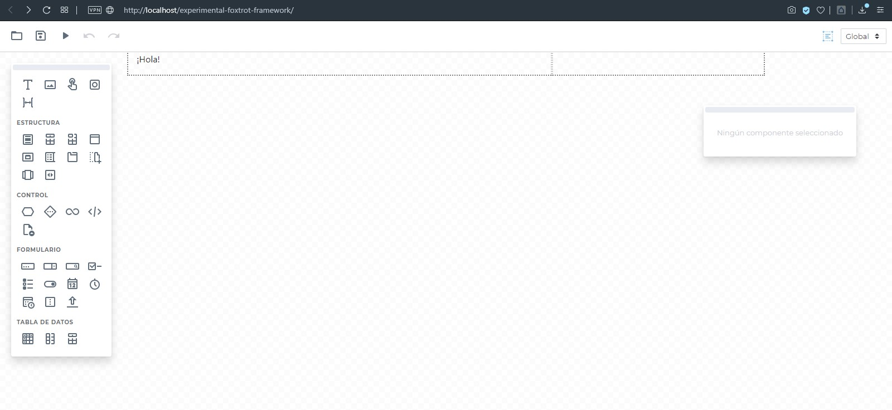

Trabajo en curso y experimentos para el desarrollo de Foxtrot 6 (https://github.com/foxtrotarg/foxtrot-framework) y otros productos. 

### Qué estamos desarrollando

#### Editor

Editor de vistas WYSIWYG: Nuestro editor de vistas actual trabaja íntegramente con objetos y cada vista es dibujada en tiempo de ejecución. Buscamos un editor que "compile" la vista, almacenándola en html/css, pero sin perder la relación entre elementos del DOM y los objetos del framework.

El editor se acerca a su versión final. En líneas generales, falta (entre otros detalles y TODOs):
- Cortar, copiar, pegar, eliminar.
- Al arrastrar sobre un componente, deben aparecer las áreas a su alrededor para poder soltar arriba/a la izquierda o abajo/a la derecha del mismo.
- Selección múltiple.
- Barra de formatos (negrita, cursiva, etc.) al editar textos.
- Determinar si un elemento puede ser hijo o no de otro al arrastrar y soltar.

La siguiente etapa consistirá en:
- Definición de propiedades comunes a todos los componentes.
- Desarrollo de componentes concretos.
- Integración con un gestor de vistas y archivos; finalización de los métodos de guardado/previsualización/apertura.
- Desarrollo del framework del frontend (controladores, etc.).

#### Comunicación cliente<->servidor transparente

Ya existe un prototipo funcional demostrando esto, ver frontend/backend.js.

Cada vista cuenta con dos controladores: Uno de backend (php) y otro de frontend (js). Podría decirse que es un modelo MVCC 😋.

Es posible invocar métodos desde uno a otro en forma transparente para el desarrollador. Lógicamente, el backend solo puede hacerlo como respuesta a una solicitud y es asincrónico. Por ejemplo (`ctl` es el nombre del controlador para la vista actual):

_js:_

    backend.foo(function(respuesta) {           //Invocará ctl::foo(1,2,3) (php) y devolverá el retorno de la misma al callback
        ...
    },1,2,3);

    backend.bar(1,2,3);                         //Invocará ctl::bar(1,2,3) (php)

_php:_

    function foo($a,$b,$c) {                    //El retorno de la función volverá automáticamente al callback
        return 'Hola';
    }

    frontend.bar(1,2,3);                        //Invocará ctl.bar(1,2,3) (js)

#### API js / Frontend

El frontend de Foxtrot tiene las siguientes particularidades:

- La interfaz está formada por componentes, cada uno con propiedades y métodos.
- Las vistas pueden cargarse dentro de una única página (con transición entre las mismas) o compilarse en archivos html independientes (lo nuevo de esta versión).
- Permite una comunicación cliente-servidor bidireccional totalmente transparente para el desarrollador.
- Debe estar desacoplado del backend y ser extremadamente liviano y optimizado para dispositivos / Cordova.
- Sin embargo, estamos considerando introducir algún mecanismo que permita que la vista sea preprocesada en el servidor (php), en lugar de la carga normal por ajax, solo disponible para aquellas aplicaciones que se implementen junto con el backend en el mismo servidor web.
- Gestor del DOM propio (adiós jQuery).
- El API se desarrolla totalmente en español. Solo mantendremos los nombres internos (eventos, etc.) y siglas en inglés.

#### API php / Backend

El backend de Foxtrot tiene las siguientes particularidades:

- Es headless, totalmente desacoplado del frontend.
- Es multiaplicación (una instalación puede contener varias aplicaciones y la aplicación solicitada se determina a partir del dominio).
- Permite una comunicación cliente-servidor bidireccional totalmente transparente para el desarrollador.
- Permite exponer métodos php en forma automática de manera segura.
- El API se desarrolla totalmente en español. Solo mantendremos los nombres internos (eventos, etc.) y siglas en inglés.

La mejora principal en esta versión viene en el último punto: No era tan automático.

No es posible simplemente asumir que un método público (`public`) lo es en el sentido _hacia afuera_ de la aplicación (normalmente, un método será público porque debe ser accesible por otras clases, _no_ por el usuario). La idea para simplificar la apertura de métodos HTTP es crear un nuevo tipo de clase que sólo contenga dichos métodos (todos expuestos).

Tipos de clases (se determina en forma automática según espacio de nombres y ascendencia):

- Controlador de vista (controlador de backend--también existe el de frontend, en js).
- Clases de la aplicación.
- Clases de métodos públicos http.
- Modelo de datos.
- Otras clases del del framework (enrutamiento, librerías de terceros, módulos, componentes, etc.).

### Más información

contacto@foxtrot.ar

www.foxtrot.ar

Licencia: Apache 2.0

Íconos por Icons8 - https://icons8.com/icons/material-outlined